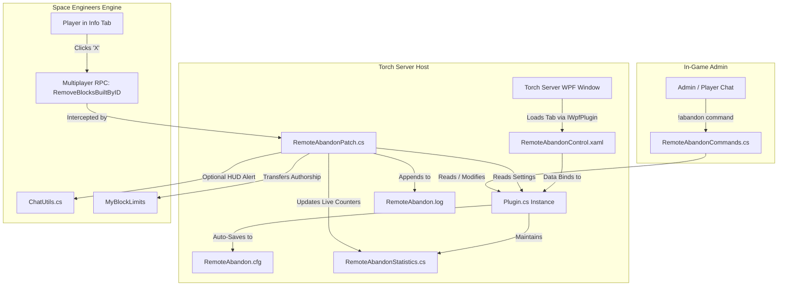

# Remote Grid Abandon (Torch Plugin)

A high-performance Space Engineers Torch server plugin that overrides the native **Terminal -> Info Tab** grid removal ("X" button) to safely strip beacons and transfer/clear ownership rather than deleting the physical grid. Designed to preserve derelicts for salvage and automated cleanup cycles while instantly returning PCU budgets to players.

Features a modern dark-themed Torch WPF control panel, persistent XML configuration, real-time telemetry, dedicated log auditing, and in-game admin/player chat commands.

---

## 1. Overview & Architecture

### What this Plugin Accomplishes
* **Player UX:** Players can abandon remote grids from anywhere across planets or space using the native **Terminal -> Info Tab** list and clicking the **"X"** button.
* **Derelict Preservation:** The physical grid structure remains in space/world as an abandoned derelict for periodic server trash cleanup or player salvaging (cancels Keen's full grid deletion).
* **Beacon Stripping:** Beacons belonging to the abandoning player across the grid and attached subgrids are destroyed. Any beacons owned by or reassigned to other players/factions (such as scrap or claim beacons) remain untouched.
* **Ownership Reset:** Functional blocks are set to `Nobody` (`0L`) (or a custom NPC Identity ID), skipping preserved beacon blocks.
* **PCU / Grid List Cleanup:** The player's authorship is transferred to `0L` (or custom ID), instantly returning their PCU/Block limit budget and removing the grid from their Info Tab.
* **Combat & Exploit Protection:** Optional combat lockout prevents players from dumping ships when hostile players are within range (defaults to off), and optional max PCU limits can be enforced.
* **Dedicated Log File:** Appends all abandonment events with timestamps, player Steam IDs, grid names, and PCU refunds directly into `RemoteAbandon.log`.
* **WPF Torch GUI & In-Game Commands:** Full graphical interface in Torch Server matching modern dark theme standards, plus real-time statistics telemetry and `!abandon` chat commands.



---

## 2. Project Structure & Key Components

| File | Purpose |
| :--- | :--- |
| [`TorchRemoteCleanupPlugin.csproj`](TorchRemoteCleanupPlugin/TorchRemoteCleanupPlugin.csproj) | Modern SDK-style project file configured for .NET Framework 4.8 (`net48`, `x64`) with `<UseWPF>true</UseWPF>` enabled for WPF markup compilation. Builds `RemoteAbandon.dll`. |
| [`manifest.xml`](TorchRemoteCleanupPlugin/manifest.xml) | Plugin metadata descriptor for Torch (`Remote Grid Abandon`, version 2.0.0). |
| [`Plugin.cs`](TorchRemoteCleanupPlugin/Plugin.cs) | Main entry point inheriting `TorchPluginBase` and implementing `IWpfPlugin`. Manages persistent XML configuration (`Persistent<RemoteAbandonConfig>`), statistics, and lifecycle. |
| [`Config/RemoteAbandonConfig.cs`](TorchRemoteCleanupPlugin/Config/RemoteAbandonConfig.cs) | Observable ViewModel configuration class containing all plugin settings with `[Display]` annotations. |
| [`Services/RemoteAbandonStatistics.cs`](TorchRemoteCleanupPlugin/Services/RemoteAbandonStatistics.cs) | Thread-safe real-time telemetry model tracking grids abandoned, subgrids handled, beacons destroyed, PCU refunded, and last grid info. |
| [`Utils/ChatUtils.cs`](TorchRemoteCleanupPlugin/Utils/ChatUtils.cs) | Helper for safely dispatching in-game notifications to players via `ModCommunication.SendMessageTo`. |
| [`Commands/RemoteAbandonCommands.cs`](TorchRemoteCleanupPlugin/Commands/RemoteAbandonCommands.cs) | In-game chat command module under `[Category("abandon")]` providing `status`, `stats`, `resetstats`, `toggle`, `reload`, `set`, and `info`. |
| [`Views/RemoteAbandonControl.xaml`](TorchRemoteCleanupPlugin/Views/RemoteAbandonControl.xaml) | WPF user control designed with dark theme styling. Contains the **Configuration** and **Live Telemetry** tabs. |
| [`Views/RemoteAbandonControl.xaml.cs`](TorchRemoteCleanupPlugin/Views/RemoteAbandonControl.xaml.cs) | Code-behind for the WPF view handling save confirmation and statistics reset. |
| [`RemoteAbandonPatch.cs`](TorchRemoteCleanupPlugin/RemoteAbandonPatch.cs) | Harmony prefix patch on `MyBlockLimits.RemoveBlocksBuiltByID` executing the customizable abandon workflow and writing audit logs. |

---

## 3. Configuration Reference

The configuration file is saved automatically to `Torch\Plugins\Storage\RemoteAbandon\RemoteAbandon.cfg` (or in the plugin directory).

### Configuration Options

| Setting | Type | Default | Description |
| :--- | :---: | :---: | :--- |
| `Enabled` | `bool` | `true` | Master toggle. When `false`, Keen's vanilla full-grid deletion runs. |
| `EnableDebugLogging` | `bool` | `false` | Enables verbose trace logging in the Torch server console. |
| `EnablePlayerCommands` | `bool` | `false` | Allows non-admin players to execute informational commands (`!abandon info`). |
| `WriteDedicatedLogFile` | `bool` | `true` | Appends all abandon events to `RemoteAbandon.log` in plugin storage. |
| `DestroyPlayerBeacons` | `bool` | `true` | Destroys beacons built or owned by the abandoning player. |
| `PreserveOtherPlayerBeacons` | `bool` | `true` | Keeps claim and scrap beacons owned by other identities/factions intact. |
| `DepowerGridOnAbandon` | `bool` | `false` | Powers down batteries, reactors, and solar panels on abandon. |
| `ResetTerminalOwnershipToNobody` | `bool` | `true` | Wipes block ownership on terminal blocks to Nobody (`0L`). |
| `TransferAuthorshipToNobody` | `bool` | `true` | Transfers block authorship away from player to refund PCU budget. |
| `CustomOwnerIdentityId` | `long` | `0L` | Specific Identity ID (e.g. Scrap NPC) to receive ownership/authorship instead of Nobody (`0L`). |
| `PreventAbandonInCombat` | `bool` | `false` | Blocks grid abandonment if enemy players are nearby. |
| `CombatCheckRadius` | `float` | `3000.0` | Scan radius in meters for hostile entities. |
| `MaxGridPCU` | `int` | `0` | Maximum PCU allowed to be abandoned (`0` = no limit). |
| `SendNotificationToPlayer` | `bool` | `true` | Sends HUD on-screen message to player upon abandonment. |
| `NotificationMessage` | `string` | `...` | Custom template with `{0}` placeholder for grid display name. |

---

## 4. In-Game Chat Commands

Commands use the `!abandon` prefix (to avoid collisions with Torch Essentials):

### Admin Commands (`MyPromoteLevel.Admin`)
* `!abandon status` - Displays current plugin status and configuration summary.
* `!abandon stats` - Displays real-time telemetry counters (grids abandoned, beacons destroyed, PCU refunded).
* `!abandon resetstats` - Resets all telemetry counters to zero.
* `!abandon toggle` - Toggles the plugin between Active and Disabled.
* `!abandon reload` - Reloads configuration from disk.
* `!abandon set <property> <value>` - Dynamically modifies a configuration parameter (e.g. `!abandon set combatcheck true`).

### Player Commands (`MyPromoteLevel.None`)
*(Requires `EnablePlayerCommands` toggle enabled in GUI/config)*
* `!abandon info` - Shows current server grid abandonment rules and beacon behavior.

---

## 5. Building & Deployment

### 1. Configure Torch Directory Path
Open [`TorchRemoteCleanupPlugin.csproj`](TorchRemoteCleanupPlugin/TorchRemoteCleanupPlugin.csproj) and verify `<TorchDir>`:
```xml
<TorchDir>C:\SE_GVK_S10</TorchDir>
```

### 2. Build the Solution
```bash
dotnet build -c Release TorchRemoteCleanupPlugin\TorchRemoteCleanupPlugin.csproj
```
The build automatically creates and deploys the zip archive:
```
C:\SE_GVK_S10\Plugins\RemoteAbandon.zip
├── RemoteAbandon.dll
├── RemoteAbandon.pdb
└── manifest.xml
```

---

## 6. In-Game Testing Checklist

1. **GUI & Persistence Verification**:
   - [ ] Start Torch Server $\rightarrow$ Open **Remote Grid Abandon** tab.
   - [ ] Verify both **Configuration** and **Live Telemetry** tabs are populated.
   - [ ] Modify a setting (e.g. Enable Debug Logging) and click **Save Configuration**.
2. **In-Game Functionality**:
   - [ ] Spawn a test grid with armor, thrusters, and a beacon.
   - [ ] Open Terminal $\rightarrow$ **Info Tab** $\rightarrow$ Click **"X"** on the test ship.
   - [ ] Verify:
     - The ship **remains in world as a derelict** (not deleted).
     - The beacon is destroyed.
     - PCU is immediately refunded and grid removed from player's Info tab.
     - HUD notification is displayed to the player.
     - The **Live Telemetry** tab in Torch GUI increments the Grids Abandoned counter.
     - `RemoteAbandon.log` in plugin storage records the timestamped event.