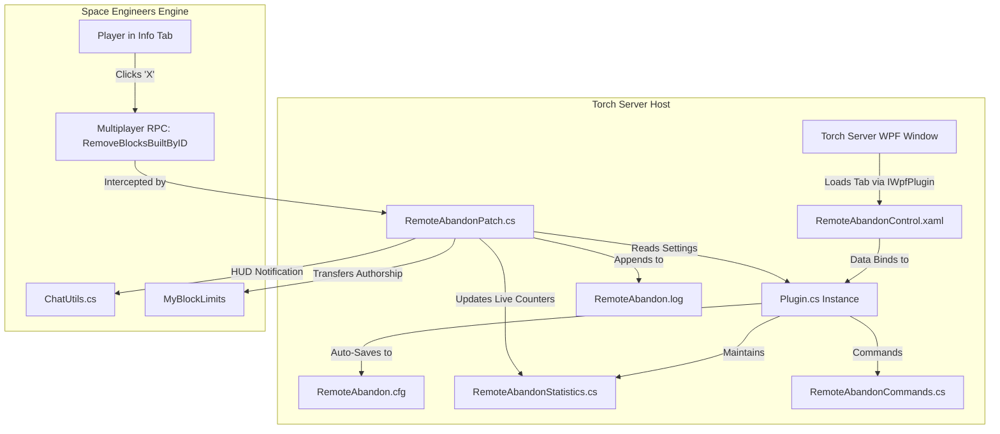
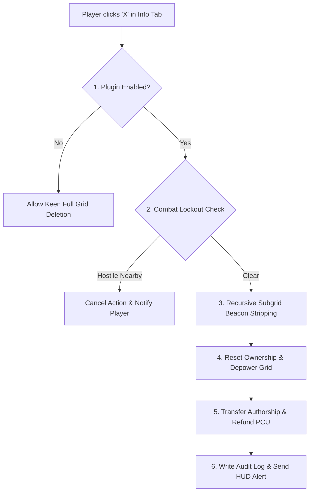

# 🚀 Remote Grid Abandon

**Derelict Grid Abandonment, Beacon Stripping & PCU Reclamation System for Space Engineers Torch Servers**

* **Plugin Type**: Torch Dedicated Server Plugin (.NET Framework 4.8)  
* **Target Server**: GV - Deserts of Kharak (GVK)  
* **Package**: `RemoteGridAbandon.zip`  

---

## 1. Project Intent & Philosophy

In vanilla Space Engineers, when a player clicks the **"X"** (Remove) button in their **Terminal -> Info Tab**, the server immediately and destructively deletes the physical grid from existence. This eliminates salvage opportunities, prevents automated debris/trash cleanup cycles from managing derelicts, and encourages immersion-breaking combat-logging.

**`Remote Grid Abandon`** transforms grid removal into an automated **Derelict Abandonment Workflow**:
* 🚀 **Derelict Preservation**: The physical grid structure remains in space or on planetary terrain as an abandoned derelict for salvage or scheduled cleanup cycles (cancels Keen's full grid deletion).
* 🚨 **Smart Beacon Stripping**: Player beacons across the main grid and all attached subgrids are destroyed. Any scrap or claim beacons belonging to other factions/players remain intact.
* 👤 **Ownership Reset**: Functional blocks are set to `Nobody` (`0L`) (or a designated NPC Scrap Identity ID), ensuring derelicts do not fire weapons or consume grid faction limits.
* 💰 **Instant PCU & Block Limit Refund**: Authorship (`BuiltBy`) is transferred away from the abandoning player, immediately refunding their PCU budget and removing the grid from their Info Tab list.
* ⚔️ **Combat & Exploit Lockout**: Optional safety check blocking ship abandonment if hostile players or enemy ships are within combat range (default: 3000m).
* 📝 **Dedicated Audit Logging**: Appends all abandonment events with timestamps, player Steam IDs, grid names, and PCU refunds directly into `RemoteAbandon.log`.
* ⚡ **Zero Hot-Path Allocations**: Clean recursive subgrid traversal and execution hooks without garbage collection spikes.

---

## 2. System Architecture



### Project Structure & Key Components

| Component | File | Purpose |
| :--- | :--- | :--- |
| **Plugin Entry** | [`Plugin.cs`](TorchRemoteCleanupPlugin/Plugin.cs) | Main lifecycle controller (`TorchPluginBase`, `IWpfPlugin`). Manages persistent XML config, telemetry statistics, and lifecycle. |
| **Config Model** | [`Config/RemoteAbandonConfig.cs`](TorchRemoteCleanupPlugin/Config/RemoteAbandonConfig.cs) | Persistent ViewModel containing all configurable toggles, combat radii, and messages with Torch `[Display]` annotations. |
| **Statistics** | [`Services/RemoteAbandonStatistics.cs`](TorchRemoteCleanupPlugin/Services/RemoteAbandonStatistics.cs) | Thread-safe real-time telemetry tracking grids abandoned, subgrids handled, beacons destroyed, and PCU refunded. |
| **Torch Patch** | [`RemoteAbandonPatch.cs`](TorchRemoteCleanupPlugin/RemoteAbandonPatch.cs) | Prefix hook on `MyBlockLimits.RemoveBlocksBuiltByID` via `Torch.Managers.PatchManager` intercepting Info Tab grid deletion. |
| **Commands** | [`Commands/RemoteAbandonCommands.cs`](TorchRemoteCleanupPlugin/Commands/RemoteAbandonCommands.cs) | In-game and console admin/player commands under the `!abandon` prefix. |
| **WPF GUI View** | [`Views/RemoteAbandonControl.xaml`](TorchRemoteCleanupPlugin/Views/RemoteAbandonControl.xaml) | Dark-themed WPF interface with **Configuration** and **Live Telemetry** tabs. |
| **Chat Utilities** | [`Utils/ChatUtils.cs`](TorchRemoteCleanupPlugin/Utils/ChatUtils.cs) | Helper for safely dispatching in-game HUD alerts and notifications to players. |

---

## 3. Pipeline & Mechanics Deep-Dive

### The 5-Step Abandonment Workflow

When a player clicks the **"X"** button on a grid in their Info Tab, the patch intercepts the network RPC:



### Workflow Steps Breakdown

| Step | Action | Mechanism |
| :---: | :--- | :--- |
| **1** | **RPC Interception** | Hooks `MyBlockLimits.RemoveBlocksBuiltByID` with a Torch `PatchManager` prefix, preventing Keen's `grid.Close()` call. |
| **2** | **Combat Lockout Check** | If `PreventAbandonInCombat` is active, scans within `CombatCheckRadius` (default 3000m). If enemies are near, abandonment is denied. |
| **3** | **Recursive Beacon Stripping** | Traverses mechanical and logical groups (rotors, hinges, pistons, connectors), destroying player beacons while preserving claim/scrap beacons. |
| **4** | **Ownership & Power Reset** | Sets functional blocks to `Nobody` (`0L`) (or custom NPC ID) and optionally powers down batteries, reactors, and solar panels. |
| **5** | **Authorship Transfer & PCU Refund** | Transfers block authorship away from the player to `0L`, instantly clearing PCU limits and removing the grid from the Info Tab. |

---

## 4. Engineering Particularities & Edge Cases

### A. Preserving Scrap & Claim Beacons
* **Problem**: Players often claim derelicts or salvage wrecks that have specialized NPC scrap beacons or allied claim markers attached.
* **Solution**: The beacon stripping routine verifies block ownership and authorship. If a beacon belongs to another faction or identity, it is **preserved**, ensuring salvage beacons remain discoverable across the desert.

### B. Recursive Subgrid Tree Traversal
* **Complex Constructs**: Modern rovers and bases feature dozens of subgrids connected via hinges, rotors, and pistons.
* **Recursive Safe Iterator**: Traverses `MyCubeGridGroups.Static.Physical` and `Mechanical` to ensure every attached subpart has its beacons stripped and authorship cleared simultaneously, preventing orphan blocks from locking player PCU.

### C. Dedicated Audit Logging (`RemoteAbandon.log`)
* Every abandonment event writes an immutable log record with timestamp, player Steam ID, player display name, grid name, block count, and total PCU refunded to assist server admins with auditing and dispute resolution. Offloaded asynchronously to `ThreadPool` with thread locking to prevent main-thread sim-speed hitching.

### D. Design Notes & Space Engineers Engine Quirks

* **Keen Block Inheritance Gotcha (`MyBeacon` & `IMyBeacon`)**:
  In Keen's object model, `MyBeacon` derives from `MyFunctionalBlock`, which derives from `MyTerminalBlock` (`MyEntity` &rarr; `MyCubeBlock` &rarr; `MyTerminalBlock` &rarr; `MyFunctionalBlock` &rarr; `MyBeacon`). Consequently, `slim.FatBlock is MyTerminalBlock` is **true** for beacons. To prevent the terminal ownership reset routine (Step C) from wiping ownership on beacons preserved in Step A (e.g. allied claim beacons or NPC scrap markers), the check explicitly filters `terminalBlock is not IMyBeacon`. Using the `IMyBeacon` interface also ensures full compatibility with any modded beacon definitions.
* **Bitmap Font Limitations in In-Game Chat**:
  Space Engineers uses custom bitmap font sheets for in-game chat and HUD toasts. Non-ASCII Unicode characters (such as bullets `•` / `U+2022`) lack glyph definitions in standard SE fonts and render as missing-glyph "tofu" boxes on player screens. Command outputs strictly use ASCII hyphen bullets (`- `) to guarantee clean in-game presentation.
* **DamageSystem Dispatch & Hot-Path Efficiency**:
  The Space Engineers `DamageSystem` fires `RaiseAfterDamageApplied` on every damage pulse (every grinder tick, deformation event, or explosive fragment — potentially thousands per second in heavy combat). In Keen's engine, grid damage events exclusively pass concrete `MySlimBlock` references; fat blocks and grids are never passed directly to this event. `DamageTracker` patterns directly on `target as MySlimBlock` with zero allocations and no `try/catch` in the hot path.
* **PCU Authorship vs. Grid PCU Accounting**:
  `grid.BlocksPCU` reflects total construct PCU across all builders. However, `grid.TransferBlocksBuiltByID(senderIdentityId, ...)` only transfers and refunds blocks where `slim.BuiltBy == senderIdentityId`. To prevent telemetry skew on captured derelicts or multi-builder constructs, the plugin calculates player PCU refunds strictly from blocks authored by the abandoning identity.

---

## 5. In-Game & Console Admin Commands (`!abandon`)

Commands use the `!abandon` prefix.

### For Players (`MyPromoteLevel.None`)
*(Requires `EnablePlayerCommands` enabled in config/GUI)*
* `!abandon info` — Displays server grid abandonment rules, beacon stripping behavior, and combat restrictions.

### For Admins (`MyPromoteLevel.Admin`)
* `!abandon status` — Displays current configuration summary and active options.
* `!abandon stats` — Displays real-time telemetry (grids abandoned, beacons destroyed, PCU refunded, last player).
* `!abandon resetstats` — Resets all telemetry counters to zero.
* `!abandon toggle` — Master plugin on/off switch.
* `!abandon set <property> <value>` — Modifies a configuration parameter dynamically on the fly (e.g. `!abandon set combatcheck true`).
* `!abandon reload` — Reloads configuration from disk.

---

## 6. Configuration Reference (`RemoteAbandon.cfg`)

The configuration file is saved automatically to `Torch\Plugins\Storage\RemoteAbandon\RemoteAbandon.cfg` (or in the plugin directory).

```xml
<?xml version="1.0" encoding="utf-8"?>
<RemoteAbandonConfig xmlns:xsd="http://www.w3.org/2001/XMLSchema" xmlns:xsi="http://www.w3.org/2001/XMLSchema-instance">
  <Enabled>true</Enabled>
  <EnableDebugLogging>false</EnableDebugLogging>
  <EnablePlayerCommands>false</EnablePlayerCommands>
  <WriteDedicatedLogFile>true</WriteDedicatedLogFile>
  <DestroyPlayerBeacons>true</DestroyPlayerBeacons>
  <PreserveOtherPlayerBeacons>true</PreserveOtherPlayerBeacons>
  <DepowerGridOnAbandon>false</DepowerGridOnAbandon>
  <ResetTerminalOwnershipToNobody>true</ResetTerminalOwnershipToNobody>
  <TransferAuthorshipToNobody>true</TransferAuthorshipToNobody>
  <CustomOwnerIdentityId>0</CustomOwnerIdentityId>
  <PreventAbandonInCombat>false</PreventAbandonInCombat>
  <CombatCheckRadius>3000</CombatCheckRadius>
  <PreventAbandonOnDamage>false</PreventAbandonOnDamage>
  <DamageCooldownSeconds>60</DamageCooldownSeconds>
  <MaxGridPCU>0</MaxGridPCU>
  <SendNotificationToPlayer>true</SendNotificationToPlayer>
  <SendHudNotification>true</SendHudNotification>
  <SendChatNotification>true</SendChatNotification>
  <NotificationMessage>Grid '{0}' was abandoned as a derelict. PCU refunded.</NotificationMessage>
  <CombatBlockedMessage>Cannot abandon grid '{0}': Hostile players detected within {1}m!</CombatBlockedMessage>
  <DamageBlockedMessage>Cannot abandon grid '{0}': Grid took damage recently! Please wait {1}s.</DamageBlockedMessage>
  <PcuBlockedMessage>Cannot abandon grid '{0}': PCU exceeds limit ({1:N0} / {2:N0}).</PcuBlockedMessage>
</RemoteAbandonConfig>
```

### Configuration Options Table

| Setting | Type | Default | Description |
| :--- | :---: | :---: | :--- |
| `Enabled` | `bool` | `true` | Master toggle. When `false`, Keen's vanilla full-grid deletion runs. |
| `EnableDebugLogging` | `bool` | `false` | Enables verbose trace logging in the Torch server console. |
| `EnablePlayerCommands` | `bool` | `false` | Allows non-admin players to execute informational commands (`!abandon info`). |
| `WriteDedicatedLogFile` | `bool` | `true` | Appends all abandon events to `RemoteAbandon.log` in plugin storage. |
| `DestroyPlayerBeacons` | `bool` | `true` | Destroys beacons built or owned by the abandoning player (Main Feature). |
| `PreserveOtherPlayerBeacons` | `bool` | `true` | Keeps claim and scrap beacons owned by other identities/factions intact. |
| `DepowerGridOnAbandon` | `bool` | `false` | Powers down batteries, reactors, and solar panels on abandon. |
| `ResetTerminalOwnershipToNobody` | `bool` | `true` | Wipes block ownership on terminal blocks to Nobody (`0L`). |
| `TransferAuthorshipToNobody` | `bool` | `true` | Transfers block authorship away from player to refund PCU budget. |
| `CustomOwnerIdentityId` | `long` | `0L` | Specific Identity ID (e.g. Scrap NPC) to receive ownership instead of Nobody (`0L`). |
| `PreventAbandonInCombat` | `bool` | `false` | Blocks grid abandonment if enemy players are nearby. |
| `CombatCheckRadius` | `float` | `3000.0` | Scan radius in meters for hostile entities. |
| `PreventAbandonOnDamage` | `bool` | `false` | Blocks grid abandonment if grid or subgrids took damage recently. |
| `DamageCooldownSeconds` | `int` | `60` | Cooldown seconds after damage before abandonment is allowed. |
| `MaxGridPCU` | `int` | `0` | Maximum PCU allowed to be abandoned (`0` = no limit). |
| `SendNotificationToPlayer` | `bool` | `true` | Master toggle for player feedback notifications. |
| `SendHudNotification` | `bool` | `true` | Sends on-screen HUD toast alert to player. |
| `SendChatNotification` | `bool` | `true` | Sends direct in-game chat message for permanent chat log history. |
| `NotificationMessage` | `string` | `...` | Template for successful abandonment (`{0}` = Grid Name). |
| `CombatBlockedMessage` | `string` | `...` | Template when blocked by combat (`{0}` = Grid Name, `{1}` = Radius). |
| `DamageBlockedMessage` | `string` | `...` | Template when blocked by damage (`{0}` = Grid Name, `{1}` = Cooldown). |
| `PcuBlockedMessage` | `string` | `...` | Template when grid exceeds PCU (`{0}` = Grid Name, `{1}` = PCU, `{2}` = Max). |

---

## 7. Torch WPF Server Interface

The GUI integrates into the Torch Server window, matching the standard dark-themed layout of `GridDefender` and `PhysicsOptimizer`:

1. **Configuration Tab**:
   * Quick overview banner explaining the derelict preservation and beacon stripping pipeline.
   * GroupBoxes for General Settings, Beacon Stripping, Ownership/PCU, Combat Rules, and Player Notifications.
   * Auto-applies changes immediately with a manual **"Save to Disk"** button.
2. **Live Telemetry Tab**:
   * **4-Column Metric Card**: Grids Abandoned (Blue), Subgrids Handled (Green), Beacons Destroyed (Pink), and Combat Lockouts (Orange).
   * **Detailed Telemetry Breakdown**: Beacons destroyed, total PCU refunded, last abandoned grid name, player Steam ID, and timestamp.
   * **Manual Action Controls**: `Reset Telemetry Counters`.

---

## 8. License & Credits

* **Author**: GVK Modding Team
* **Target Server**: GV - Deserts of Kharak (GVK)
* **License**: [GNU AGPL-3.0](LICENSE.txt)